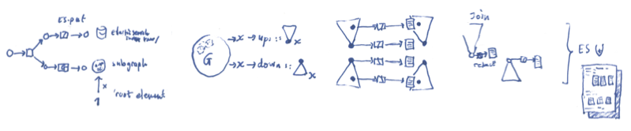

# The Degraphmalizer!



The degraphmalizer is an application on top of
[Elasticsearch](http://elasticsearch.org) that can extract graph
structure from your documents and use it to add computed attributes to
your documents.

Computed attributes? Yes, the graph stores the "global" structure of your index.
Then you can add some of this global structure to your documents. For instance
you could add an "in-degree" attribute that would tell you how many incoming
links there are to a document.

You can also ask the graph questions like: give me all documents that refer to
this document. Then from those documents you can extract some information and
store that in a computed attribute. The degraphmalizer's job is to keep such
information up to date using attribute dependency tracking.

# An example

A typical example probably makes this more clear:

Suppose we have two parties, Alice and Bob. Alice has an index of authors and
Bob maintains an index of books and they refer to each other:

Alice:

	/alice/author/gibson
	{
	  "name": "William Ford Gibson",
	  "books": ["book_id_1", "book_id_2"]
	}

Bob:

	/bob/books/book_id_1
	{
	  "title": "Neuromancer"
	}

	/bob/books/book_id_2
	{
	  "title": "All Tomorrow's Parties"
	}

In order to search for authors based on their book titles, one first has to
find the id's of the books in which the words occur. Then we have to send a
second query to find the the authors that wrote those books.

In many cases it would be nicer to have an index like this

	/alice-target/author/gibson
	{
	  "name": "William Ford Gibson",
      "books": [ { "id": "book_id_1",
                   "title": "Neuromancer"
                 },
                 { "id": "book_id_2",
                   "title": "All Tomorrow's Parties" } ] 
	}

	/bob-target/books/book_id_1
	{
	  "title": "Neuromancer",
	  "authors": [ { "id": "gibson",
                     "name": "William Word Gibson" } ]
	}

	/bob-target/books/book_id_2
	{
	  "title": "All Tomorrow's Parties"
	  "authors": [ { "id": "gibson",
                     "name": "William Word Gibson" } ]
	}

So we duplicate the data of the separate indices into derived
documents which we can directly query. This process is called
"denormalization" and we are using a graph to do it, hence:
degraphmalizer :)

# Overview of all moving parts

The Degraphmalizer works by getting notifications from elasticsearch that a document has changed. You need four things:

  1. elasticsearch
  2. degraphmalizer-elasticsearch-plugin installed in elasticsearch
  3. degraphmalizer-core
  4. degraphmalizer configuration files that tell degraphmalizer-core what to do

# Build

Build requirements:

* [Oracle JDK](http://www.oracle.com/technetwork/java/javase/downloads/index.html) 6 (since Neo4j is not yet compatible with Java 7)
* [Maven](http://maven.apache.org)

Run `mvn package` to build the artifacts. You'll find the resulting jar files in the `target` directories of the subdirectories of the modules.

# Installation

So you want to have your very own Degraphmalizer setup? You've come to the right place!

## Install elasticsearch

If you don't have an elasticsearch installation yet you can [download elasticsearch](http://www.elasticsearch.org/download/) and extract the archive. Use `~/opt/elasticsearch/` for example.

## Install degraphmalizer-elasticsearch-plugin

Unzip the degraphmalizer-elasticsearch-plugin jar with dependencies into a subdirectory in your elasticsearch plugins directory (e.g. `~/opt/elasticsearch/plugins/degraphmalizer`). You should get something like this:

    ~/opt/elasticsearch/plugins/degraphmalizer/
    |-- commons-codec-1.6.jar
    |-- commons-logging-1.1.1.jar
    |-- elasticsearch-degraphmalizer-0.20.2-0.1-SNAPSHOT.jar
    |-- httpclient-4.2.3.jar
    `-- httpcore-4.2.2.jar

## Install degraphmalizer-core

TODO
- Put degraphmalizer-core jar with dedepencies in some directory

# Configuration

Alright, all components have been installed. Now you might want to configure a few things. Read on.

## Configure degraphmalizer-elasticsearch-plugin

You can configure the Degraphmalizer plugin using the following settings in the elasticsearch configuration file `elasticsearch.yml`:

`plugin.degraphmalizer.DegraphmalizerPlugin.degraphmalizerScheme`
URI scheme used to access the Degraphmalizer, either `http` or `https`
Default: `http`

<table>
    <tr>
        <td><pre>plugin.degraphmalizer.DegraphmalizerPlugin.degraphmalizerHost</pre></td>
        <td>Hostname used to access the Degraphmalizer</td>
        <td><pre>localhost</pre></td>
    </tr>
    <tr>
        <td><pre>plugin.degraphmalizer.DegraphmalizerPlugin.degraphmalizerPort</pre></td>
        <td>Port used to access the Degraphmalizer</td>
        <td><pre>9821</pre></td>
    </tr>
    <tr>
        <td><pre>plugin.degraphmalizer.DegraphmalizerPlugin.delayOnFailureInMillis</pre></td>
        <td>Delay in milliseconds before retrying failed requests to the Degraphmalizer</td>
        <td><pre>10000</pre></td>
    </tr>
    <tr>
        <td><pre>plugin.degraphmalizer.DegraphmalizerPlugin.queueLimit</pre></td>
        <td>Number of updates to queue in memory per index before spooling to disk</td>
        <td><pre>100000</pre></td>
    </tr>
    <tr>
        <td><pre>plugin.degraphmalizer.DegraphmalizerPlugin.logPath</pre></td>
        <td>Path for error logs and overflow spool files</td>
        <td><pre>/export/elasticsearch/degraphmalizer</pre></td>
    </tr>
    <tr>
        <td><pre>plugin.degraphmalizer.DegraphmalizerPlugin.maxRetries</pre></td>
        <td>Number of times to retry sending an update to the Degraphmalizer before considering it failed</td>
        <td><pre>10</pre></td>
    </tr>
</table>

## Configure degraphmalizer-core

TODO
- Add Degraphmalizer configuration files to tell degraphmalizer-core what to do

# Running

Everything has been installed, it's all configured, let's run this thing!

## Running elasticsearch

For testing you can then start Elasticsearch with the "Run in foreground" option, like this: cd ~/opt/elasticsearch; bin/elasticsearch -f

You then see the log output on the console, `ctrl+c` to quit the elasticsearch node. Without `-f` elasticsearch starts as a background daemon, which is recommended for production.

## Running degraphmalizer-core

TODO
- Explain flags / `--help`

# Alright, some more details please

The degraphmalizer is configured through javascript. Here is an example
configuration that would transform Alice and Bob's index as above:

`conf/alice-target/author.conf.js`:

```javascript
({
	// we specify which documents we want to use as input for our new document
	sourceIndex: "alice",
	sourceType: "author",

	// for each document of type author, extract subgraph relation
	extract: function(doc, subgraph) {

		/* so subgraph is a tiny graph with one node corresponding
		   to the raw document in ES, (so that is id AND version).
		   the total graph is composed of all the subgraphs */

		// so we add on edge for each book this author wrote
		if(doc.books && doc.books.length)
		{
			doc.books.forEach(function(c) {
				// this constructs an edge from us to "/bob/books/c"
				// if that ID doesn't exist, a node is created for it.
				subgraph.addEdge("wrote_book", "bob", "books", c, false, {});
			})
		}
	},
	
	// we now define some walks
	walks: [
		{
			/* there are two options here: forward or backward
			   forward follows edges from tail to head, and vv.
			   
			   In the future you can define your own walks here,
			   using a DSL that automatically gives reverse walk
			*/ 
			direction: "forward",

			/* for each walk, we can define a number of properties
			   that need to be computed based on the walk */
			properties: {
				"books": {
				
					// this function is given a graph or tree
					// of documents from which it should compute
					// the property value
					reduce: function(doc_tree)
					{
						// return a flat list of dicts with id and title keys
						return bfs_walk(doc_tree).map(function(book) {
							id: book['id']
							title: book['title']
						})
					}
				}
			}
		}]
	}
})
```

# The rule that marks documents as 'dirty'

The rule: Suppose document `x` changes. We now want to find all
documents affected by this change. Suppose we have a property
depending on a forward walk, then all documents in a backward walk
starting at `x` must have this attribute recomputed.  (Because if I
would start a forward walk at any of these document I would eventually
hit `x`).

So this is why we need reversible graph walks.

# The pipeline

We receive a document, then

- Extract subgraph structure from the documents
  - We now want to find all document which are affected by this change:
  - Perform all defined walks on the graph, in reverse
	- Every node in these walk is marked as dirty
	  - For this node, perform the walk
	  - Retrieve all documents in the walk from ES
	  - Then, for every property defined on this walk,
		- Compute `reduce` of the walk
		- Update the document with the new attribute value


We can be quite smart about which documents to fetch first etc, but we
are not doing this ATM. patches welcome!

# The graph database

The graph should be a DAG, should you have a cycle then this will
cause a walk hitting the cycle to loop and explode. Boom.
Currently there is no cycle detection, so be careful.

You can pick any graph database supported by Blueprints. Currently
this runs on an embedded Neo4j graph.

The graph is a property graph model. That means that to each node or
label a set of key/value pairs is associated. Furthermore to each edge
we associate a label. Nodes are unique in the graph for `(id,version)`.
Edges are unique for `(head-id, head-version, label, tail-id, tail-verion)`.

It is up to you what information you store in the graph. You might
want to use this to restrict the graph walk. At the moment it doesn't
really matter much, as we just walk the entire forward or backward
tree from a node.

# The ES plugin

- Push configuration to `/_degraphmalize/`
- Watch every "index" request
- Perform degraphmalizing on one machine
- Replicate the graph to some other machines
